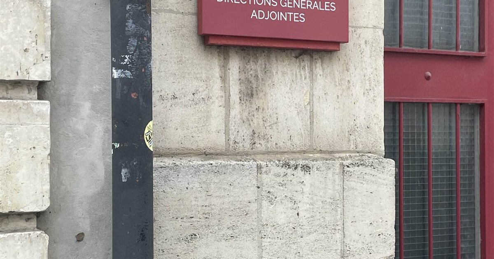

<div align="center">

  # 📡 Rapport de stage — BTS SIO SISR

  **Rapport de stage de 1ère année — Conseil Départemental de la Somme (DSI)**
  <br>
  *Infrastructure réseau, sécurité, téléphonie sur IP et interventions terrain.*

  <p>
    <a href="https://goken-0.github.io/ResumeStage/">
      
    </a>
  </p>
</div>




---

## 📝 À propos
Ce dépôt héberge mon **rapport de stage de 1ère année de BTS SIO (option SISR)**, réalisé sous forme de site web responsive et déployé sur GitHub Pages.

Le stage s'est déroulé durant **quatre semaines** à la **Direction des Systèmes d'Information (DSI)** du **Conseil Départemental de la Somme**, à Amiens. Le rapport présente l'infrastructure découverte, mes missions, les compétences acquises et un projet technique complet de configuration de switches Cisco.

> ⚠️ Les données techniques sensibles (configurations réelles, plans d'adressage de production, documentation interne) ne figurent pas dans ce rapport : elles relèvent de la confidentialité du Conseil Départemental. Les exemples présentés sont volontairement génériques et anonymisés.

## 🛠 Stack technique
Site réalisé avec les technologies fondamentales du web, sans framework :

| Technologie | Usage |
| :--- | :--- |
|  | **Structure** sémantique du rapport |
|  | **Design** « Liquid Glass », responsive et animations |
|  | **Logique** (reveals, compteurs, scrollspy, lightbox) |

## ✨ Contenu du rapport
En parcourant le site, vous trouverez :

* 🏛 **Présentation** du Conseil Départemental de la Somme et de sa DSI.
* 🧰 **Missions** : support, réseau et téléphonie sur IP, semaine après semaine.
* 🔐 **Sécurité** : modèle en tiers (0/1/2) et sensibilisation au phishing.
* 🎓 **Compétences SISR** acquises pendant le stage.
* 🖧 **Projet technique** : configuration de switches Cisco de A à Z + plan d'adressage VLAN.
* 🖼 **Galerie** photo des interventions sur le terrain.

## 📂 Structure du projet
Organisation des fichiers :

```bash
ResumeStage/
├── assets/                     # Ressources du site
│   ├── icons/                  # Favicons (svg, ico, apple-touch)
│   ├── images/                 # Photos du stage, logo, og-cover
│   ├── logos/                  # Logos des outils & technologies
│   └── svg/                    # Textures décoratives (topo, wave)
├── css/
│   └── styles.css              # Design Liquid Glass, responsive, animations
├── js/
│   └── script.js               # Reveals, compteurs, scrollspy, lightbox, nav
│
├── index.html                  # Point d'entrée unique du rapport
├── .nojekyll                   # Désactive Jekyll sur GitHub Pages
├── .gitignore                  # Fichiers exclus du versionnage
└── README.md                   # Présentation du projet
```

## 🚀 Lancer en local
Aucune dépendance. Servir le dossier :

```bash
# Python
python -m http.server 8000
# puis ouvrir http://localhost:8000
```

Ou ouvrir directement `index.html` dans un navigateur.

## ☁️ Déploiement (GitHub Pages)
```bash
git init
git add .
git commit -m "Rapport de stage SISR"
git branch -M main
git remote add origin https://github.com/Goken-0/ResumeStage.git
git push -u origin main
```
Puis **Settings → Pages** : source = branche `main`, dossier `/ (root)`.

## 📫 Me contacter
* 📧 Email : leogoken@gmail.com
* 💼 LinkedIn : www.linkedin.com/in/léo-metgy-3268a5383
* 🐙 GitHub : https://github.com/Goken-0

<div align="center"> <small>Fait avec ❤️ par Goken-0 — 2026</small> </div>
